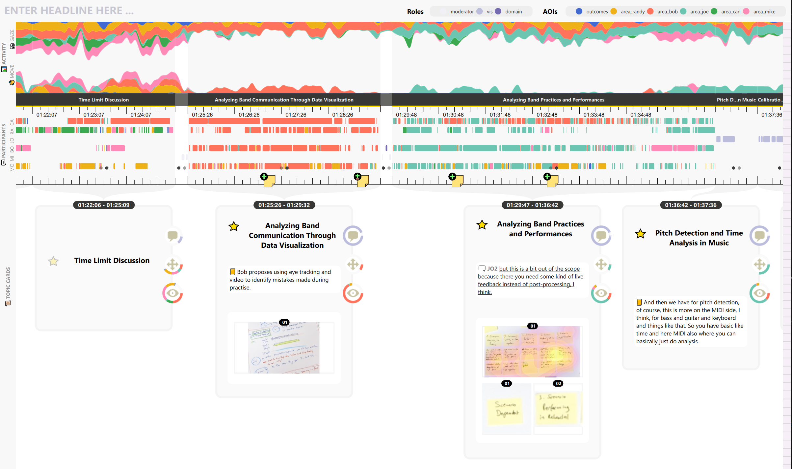

[](https://github.com/UniStuttgart-VISUS/reCAPit/actions/workflows/python-app.yml)


## Table of Contents

- [📖 About](#-about)
- [🧩 System Overview](#-system-overview)
- [⚙️ Setup Recommendations](#️-setup-recommendations)
- [🔄 Data Preparation](#-data-preparation)
- [📂 Input Requirements](#-input-requirements)
- [🚀 Launching](#-launching)
- [⚙️ Configuration](#️-configuration)
- [📚 Related Publication](#-related-publication)

## 📖 About

reCAPit is an application designed for analyzing, exploring, and documenting outcomes of collaborative design processes using speech, video, gaze, and other data modalities. Its integrated visualizations provide an overview of recorded data and enable users to author visual summaries of their analysis results. Our application includes a preprocessing pipeline capable of extracting a wide range of features from the rich, multimodal data collected

## 🧩 System Overview



## ⚙️ Setup Recommendations

Our approach is best suited for collaborative workshops involving small to medium-sized groups. We recommend instrumenting the environment with a variety of data sources. Currently, we support:

* Multi-angle video recordings
* Microphones
* Mobile eye-tracking glasses
* Digital notes (taken in Microsoft Word)

We recommend the following setup:

* A shared working area where participants collect ideas using post-its, drawings, sketches, or other materials.

* A video camera positioned to capture the working area. For horizontal surfaces (e.g., tables), a top-down camera mounted on the ceiling or a tripod is ideal.

* A microphone capable of capturing speech from all participants in the room.


## 🔄 Data Preparation

As described above, reCAPit supports data from multiple sensors. These data streams must be preprocessed before they can be used in the interface.
Please refer to the [ `preprocessing/README` ](https://github.com/UniStuttgart-VISUS/reCAPit/blob/master/preprocessing/README.md) for detailed instructions on data preprocessing.

## 📂 Input Requirements

The reCAPit frontend [ `frontend/App.py` ](https://github.com/UniStuttgart-VISUS/reCAPit/blob/master/frontend/App.py)  requires specific command-line arguments:

### Required Arguments

- `--manifest`: Path to the manifest JSON file that contains metadata about your processed data sources, including. You can find more information on the manifest file in `preprocessing/README`.
- `--user_config`: Path to the user configuration JSON file that defines visualization settings and interface behavior (see [Configuration](#-configuration) section for details)

### Optional Arguments

- `--savefile_id`: String identifier for loading a previously saved application state. If provided, the application will restore the interface to a previously saved configuration from the `saved_state` directory

## 🚀 Launching

Please make sure [astral-sh/uv](https://github.com/astral-sh/uv) is installed on your system.
UV is a Python package and project manager that eases the deployment of applications written in Python.

To launch the app, navigate to the [ `frontend/` ](https://github.com/UniStuttgart-VISUS/reCAPit/blob/master/frontend/)  directory and run the following command in your terminal:

```bash
uv run App.py --manifest path/to/manifest.json --user_config path/to/user_config.json
```

or if you want to load a previous state:

```bash
uv run App.py --manifest path/to/manifest.json --user_config path/to/user_config.json --savefile_id "2024-01-15/14-30-45"
```


> [!NOTE]
> During the first execution, all required dependencies are automatically resolved. This process may take some time.

## ⚙️ Configuration

The application can be customized using the `user_config.json` file, which contains various configuration options for visualization and interface behavior:

### Colormaps
- `areas_of_interests`: Colormap used for areas of interest visualization
- `roles`: Colormap used for role-based visualizations

### Display Settings
- `multisampling`: Anti-aliasing level for improved visual quality

### Segments
- `display_dur_sec`: Duration in seconds for topic cards to be unfolded
- `min_dur_sec`: Minimum duration in seconds for segments

### Streamgraph Configuration
- `bottom.source`: Data source for bottom streamgraph layer
- `bottom.log_scale`: Enable logarithmic scaling for the bottom layer
- `top.source`: Data source for top streamgraph layer
- `top.log_scale`: Enable logarithmic scaling for the top layer

### Timeline Settings
- `mapped_fixations.merge_threshold_sec`: Threshold for merging fixation data
- `transcript.merge_threshold_sec`: Threshold for merging transcript utterances

### Video Overlay
- `attention.colormap`: Colormap for attention video overlay
- `movement.colormap`: Colormap for movement video overlay

You can modify these settings in `user_config.json` to customize the application's appearance and behavior according to your specific requirements.

## 📚 Related Publication

For more details, please refer to our forthcoming paper [link will be added soon].
